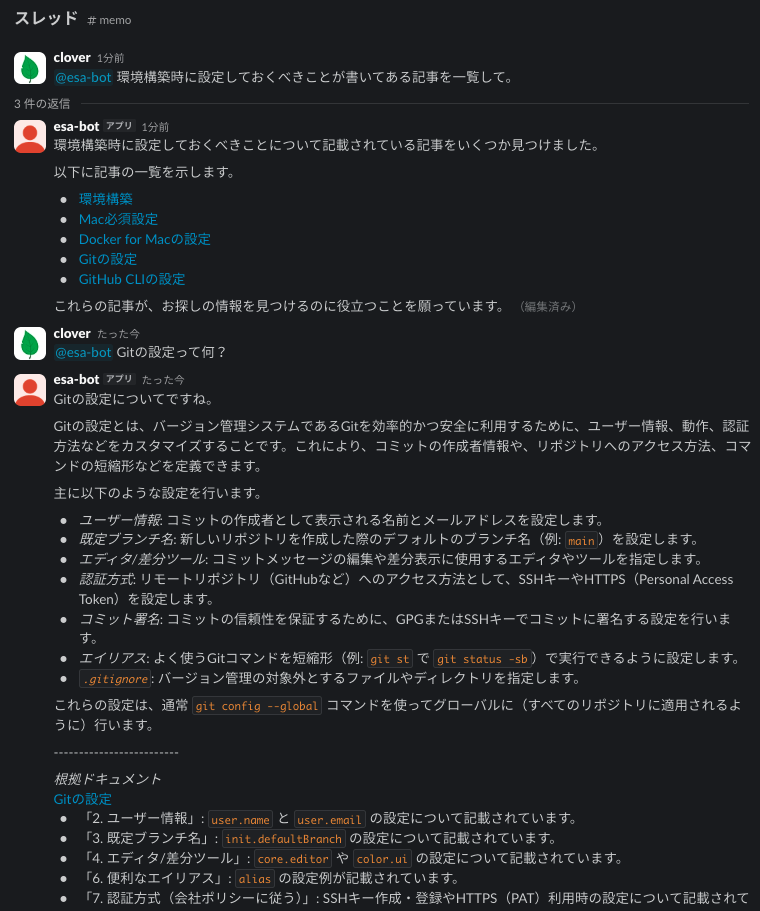

# esa Slack Assistant

esa Slack Assistant は、情報を育てて整理するドキュメントプラットフォームである[esa](https://esa.io/)と Slack を連携し、Slack 上で質問すると、esa の記事を参照して AI が回答する Slack アプリケーションです。

---

チームで esa にナレッジを蓄積しているからこそ、  
「探す手間を減らしたい」  
「欲しい情報に素早くたどり着きたい」といったことはよくあります。  


esa Slack Assistant を導入すると、Slack からそのまま記事を検索・参照でき、ナレッジ活用が加速します。




# 始め方

## Slack アプリの作成
1. [Slack API](https://api.slack.com/apps)にアクセスし、「Create New App」からAppを作成
2. 「From a manifest」を選択し、インストールするワークスペースを選択
3. 「YAML」に[app_manifest.deploy.yml](app_manifest.deploy.yml)の内容を貼り付け、「Create App」。※`name`などは適宜変更してください。
4. 「Install App」よりワークスペースにインストール


## esa API トークンの取得
1. 「Settings」のAPI設定より「パーソナルアクセストークン v2」を発行します。スコープは `read:post`, `read:category`が必要です。


## アプリのデプロイ
WebSocket モードで動作するため常時稼働するタイプなら問題ありません。

以下の必須環境変数を設定します。
```
SLACK_BOT_TOKEN= <OAuth & Permissions > OAuth Tokens>
SLACK_APP_TOKEN= <Basic Information > App-Level Tokens > Generate an app-level token. Scope: "connections:write">
SLACK_SIGNING_SECRET=<Basic Infomation > Signing Secret>

ESA_API_KEY=<your_esa_api_key>
ESA_TEAM_NAME=<your_team_name>

GOOGLE_CLOUD_PROJECT_ID=<project-id>
```

その他の設定
```
# デフォルト値
GOOGLE_CLOUD_LOCATION=us-central1
GOOGLE_GEMINI_MODEL=gemini-2.5-flash

LOG_LEVEL=info
LOG_FORMAT=
```

### Google Cloud Run
リビジョン スケーリングの設定でインスタンスの最小数は1以上に設定してください。

VertexAI を利用しているため、Cloud Run のリージョンは VertexAI が利用可能なリージョンにしてください。
Cloud Run のサービスアカウントには VertexAI を利用できるロールを付与してください。


### Google Cloud 以外の環境
VertexAIのAPIキーには対応していないため、[Workload Identity Federation](https://cloud.google.com/iam/docs/workload-identity-federation?hl=ja) を利用します。

...
